# UML Diagrams - Ride Sharing & Food Delivery Platform

This document contains comprehensive UML diagrams for the ride-sharing and food delivery platform, organized by diagram type and system component.

## Table of Contents

1. [Class Diagrams](#class-diagrams)
2. [Use Case Diagrams](#use-case-diagrams)
3. [Sequence Diagrams](#sequence-diagrams)
4. [Activity Diagrams](#activity-diagrams)
5. [Component Diagrams](#component-diagrams)
6. [Deployment Diagrams](#deployment-diagrams)
7. [State Diagrams](#state-diagrams)

---

## Class Diagrams

### 1. Core User Management Class Diagram

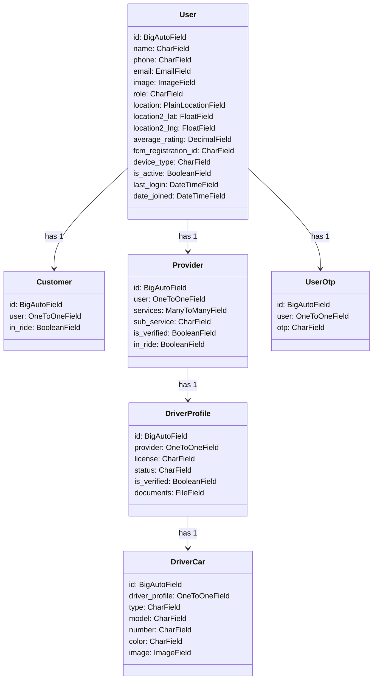

### 2. Service Management Class Diagram

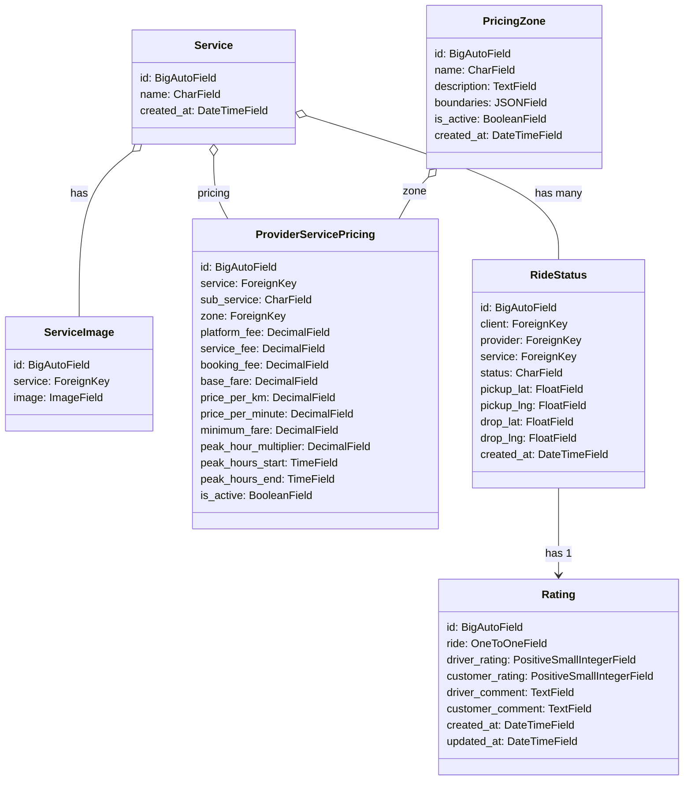

### 3. E-commerce Class Diagram

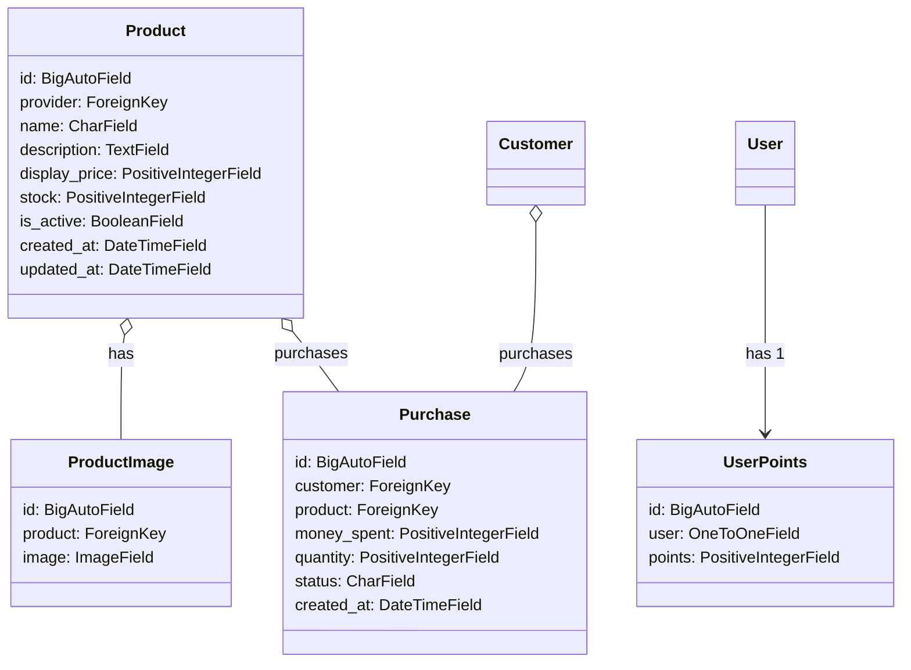

### 4. Car Rental Class Diagram

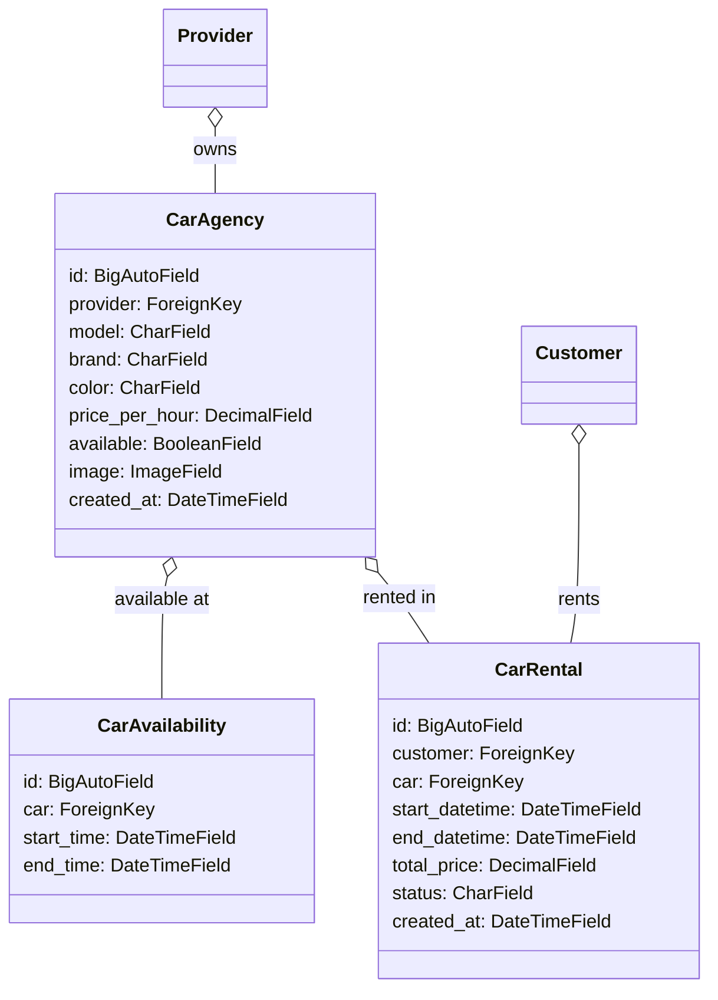

---

## Use Case Diagrams

### 1. Customer Use Cases

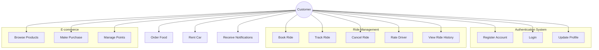

### 2. Provider/Driver Use Cases

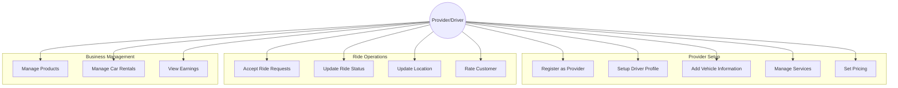

### 3. Admin Use Cases

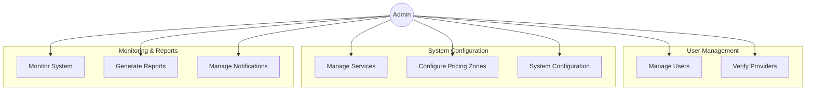

---

## Sequence Diagrams

### 1. Customer Ride Booking Sequence

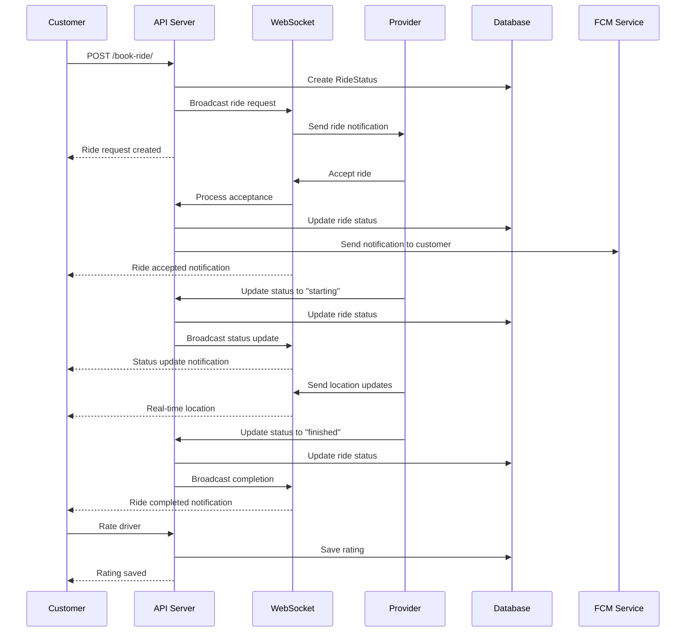

### 2. User Authentication Sequence

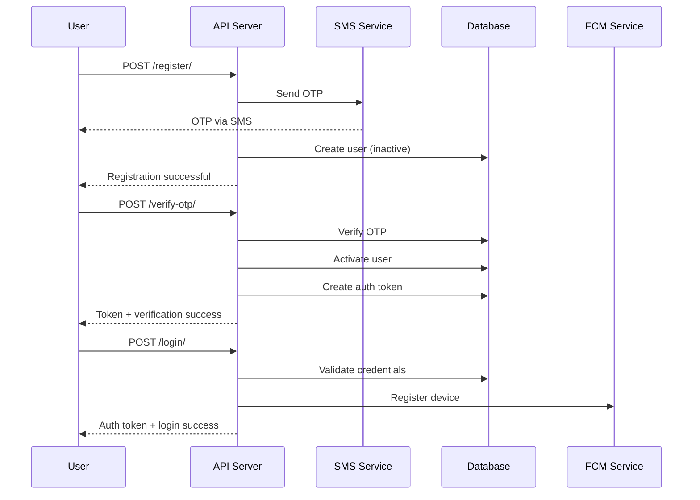

### 3. Product Purchase Sequence

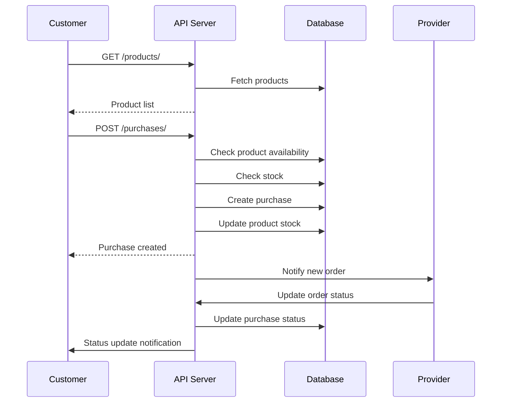

---

## Activity Diagrams

### 1. Ride Booking Process

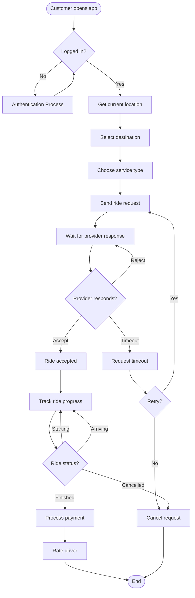

### 2. Provider Ride Acceptance Process

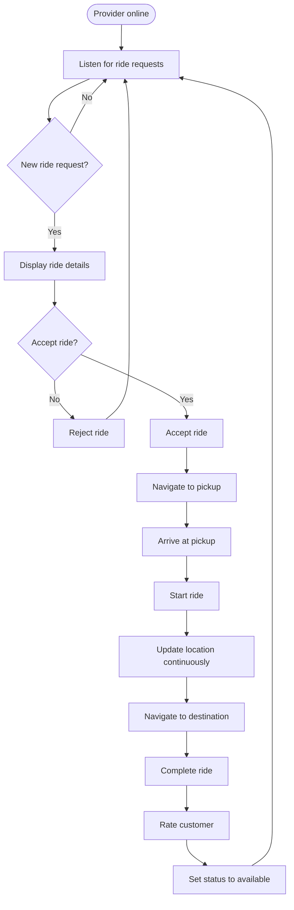

---

## Component Diagrams

### 1. System Architecture Components

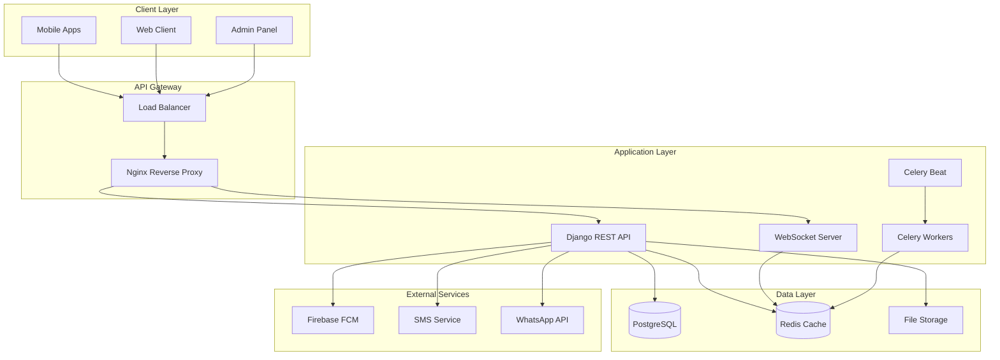

### 2. Authentication Component

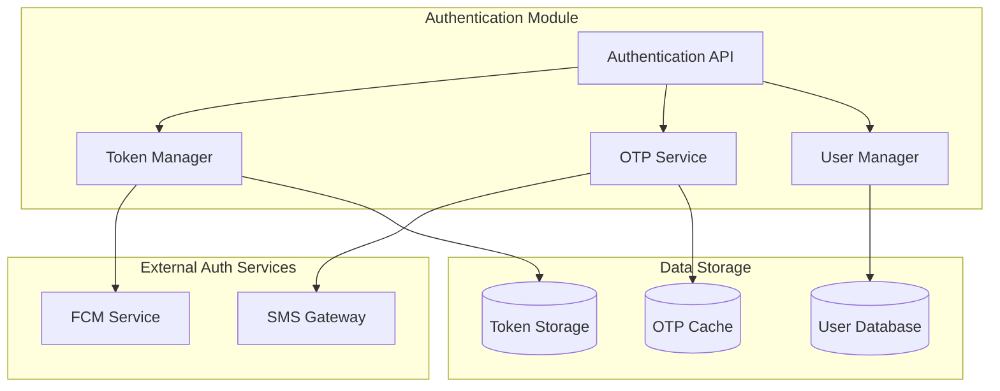

---

## Deployment Diagrams

### 1. Production Deployment Architecture

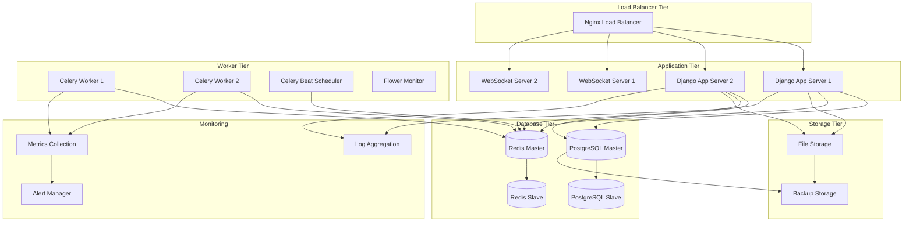

### 2. Development Environment

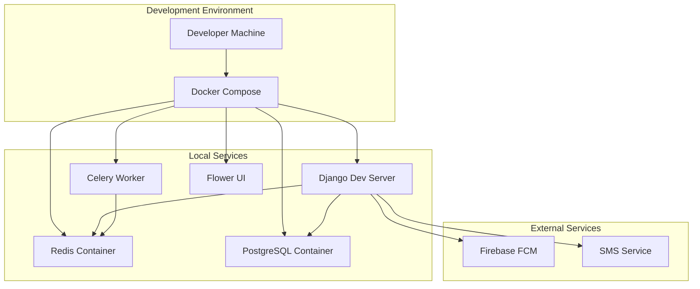

---

## State Diagrams

### 1. Ride Status State Machine

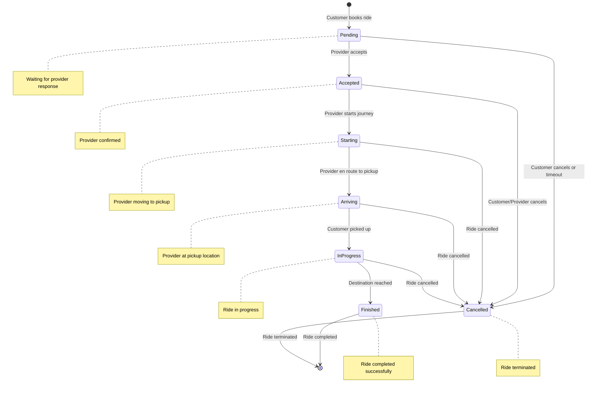

### 2. User Account State Machine

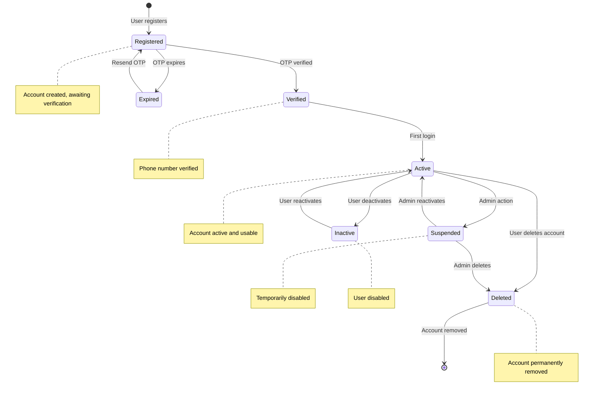

### 3. Purchase Order State Machine

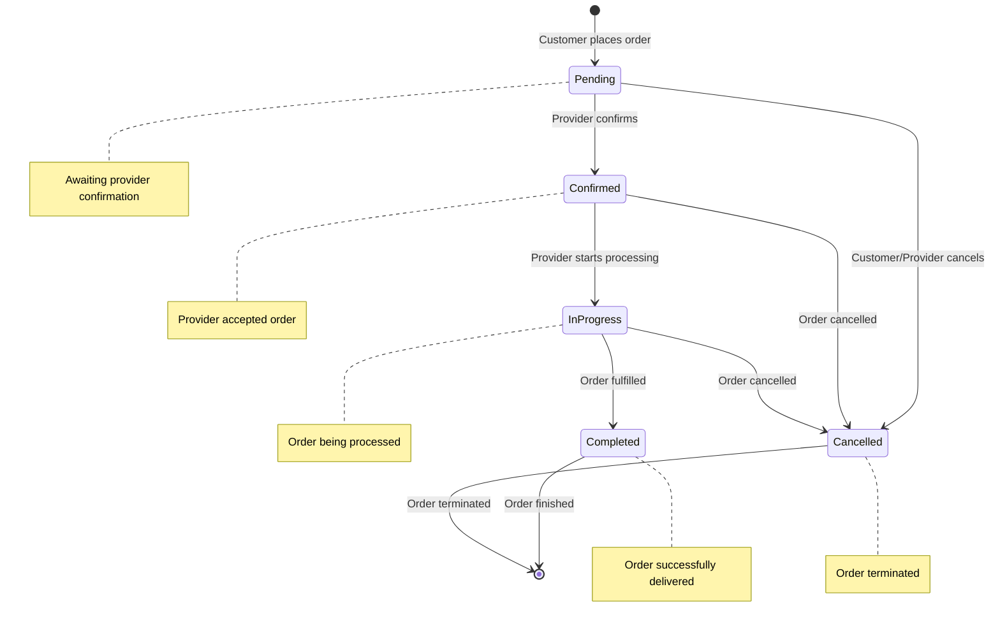

---

## Diagram Usage Guidelines

### When to Use Each Diagram Type

1. **Class Diagrams**: Use for understanding system structure, relationships between entities, and database design.

2. **Use Case Diagrams**: Use for requirements gathering, stakeholder communication, and system scope definition.

3. **Sequence Diagrams**: Use for understanding interaction flows, API design, and debugging complex processes.

4. **Activity Diagrams**: Use for business process modeling, workflow design, and user journey mapping.

5. **Component Diagrams**: Use for system architecture planning, deployment planning, and team coordination.

6. **Deployment Diagrams**: Use for infrastructure planning, DevOps setup, and scalability planning.

7. **State Diagrams**: Use for modeling entity lifecycles, business rule validation, and status management.

---

*Last Updated: July 2025*
*Version: 1.0*
