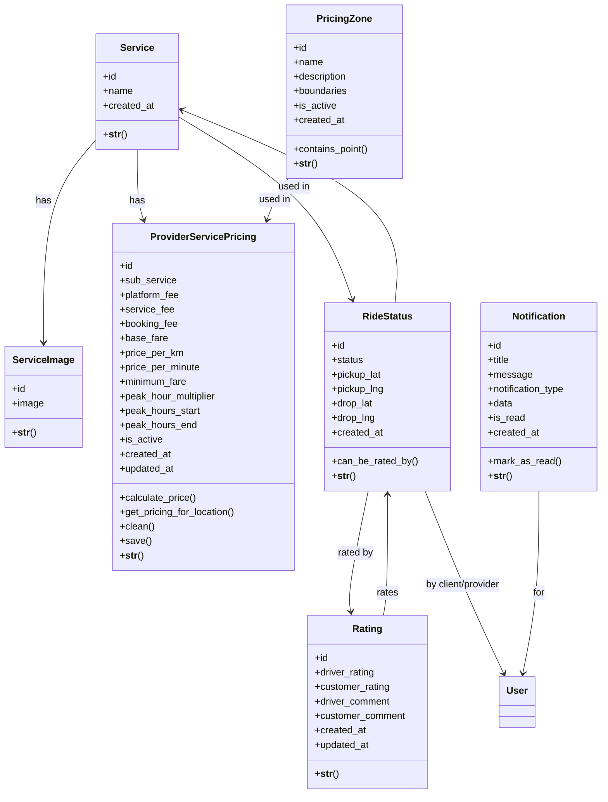
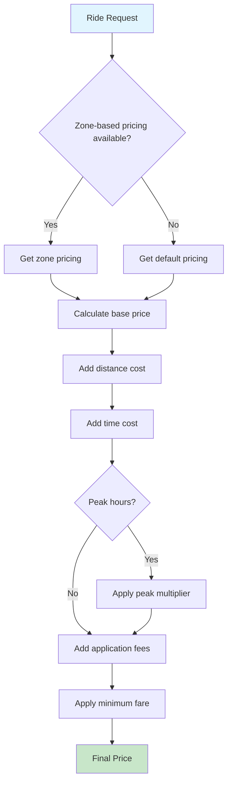

# Service Management Class Diagram

## Service and Pricing Models

This diagram shows the service management and pricing structure of the platform.

## Pricing Calculation Flow

## Key Features

### Zone-Based Pricing
- Geographic zones with polygon boundaries
- Different pricing for different areas
- Point-in-polygon algorithm for zone detection

### Dynamic Pricing
- Peak hour multipliers
- Time and distance-based calculation
- Minimum fare guarantees
- Application fees (platform, service, booking)

### Service Management
- Multiple services per provider
- Sub-services for specialized offerings
- Service-specific pricing rules

### Rating System
- Bidirectional rating (driver ↔ customer)
- Comments and numerical ratings
- Average rating calculation
