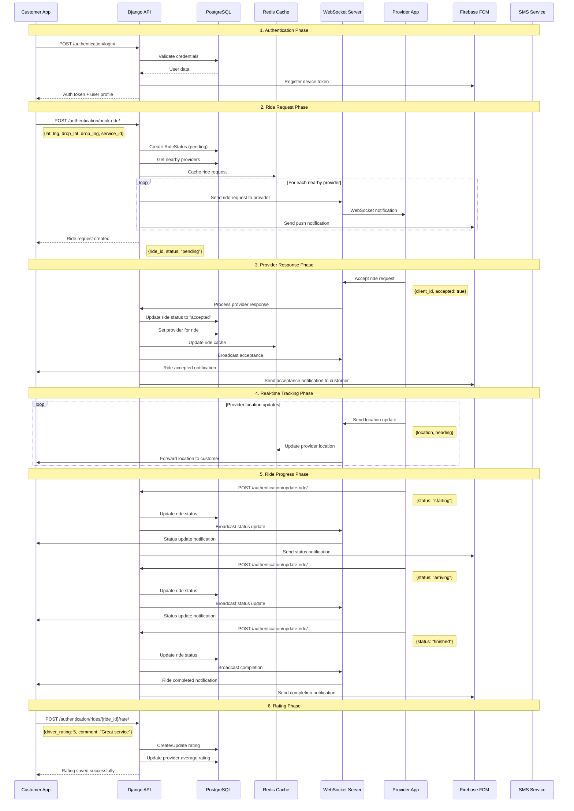
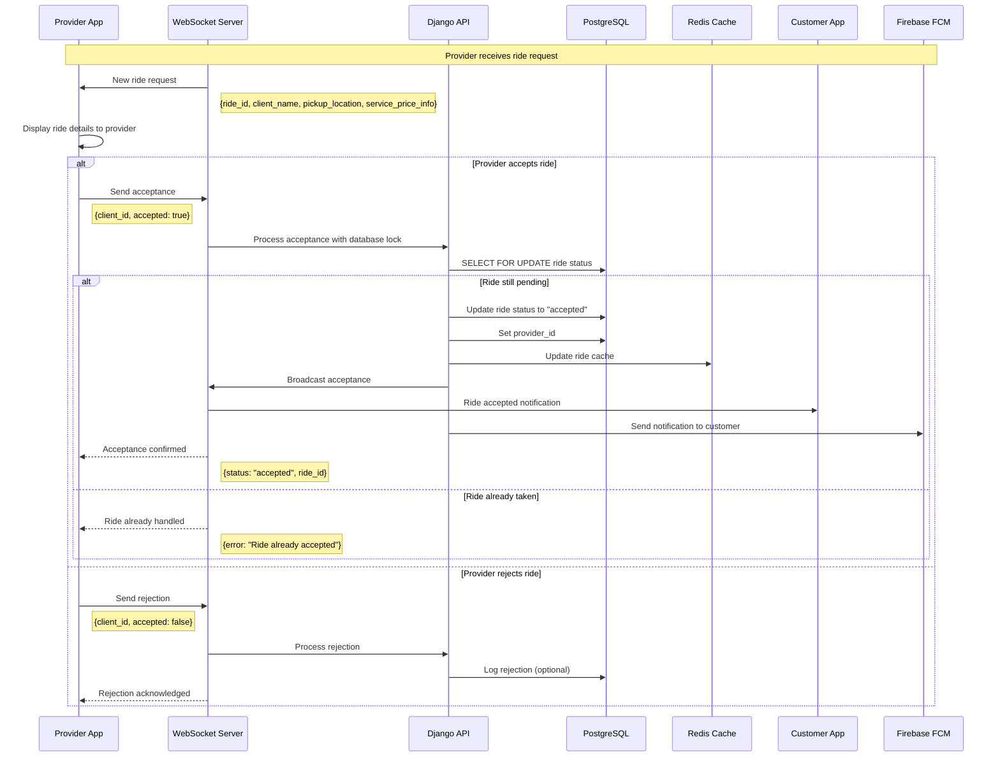
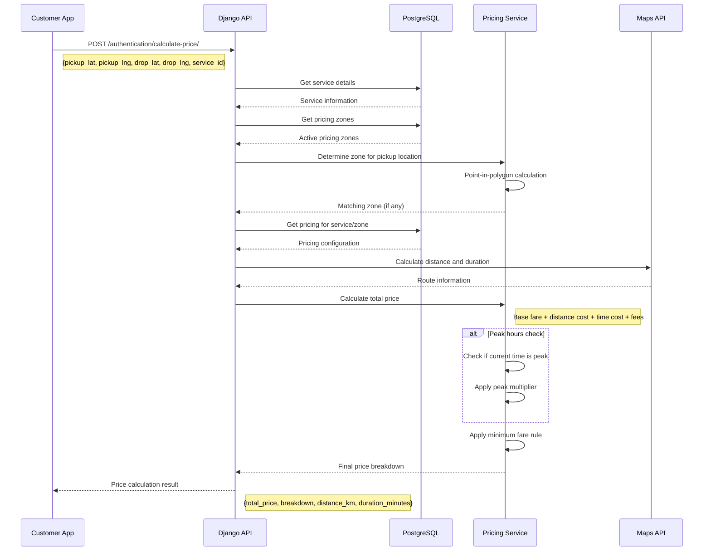
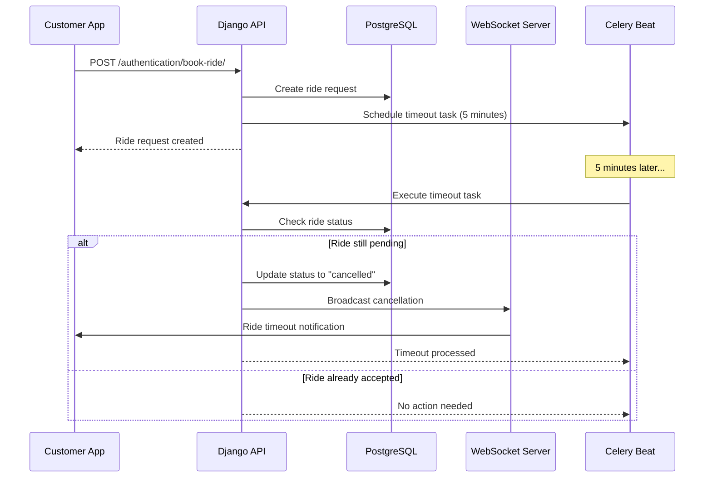
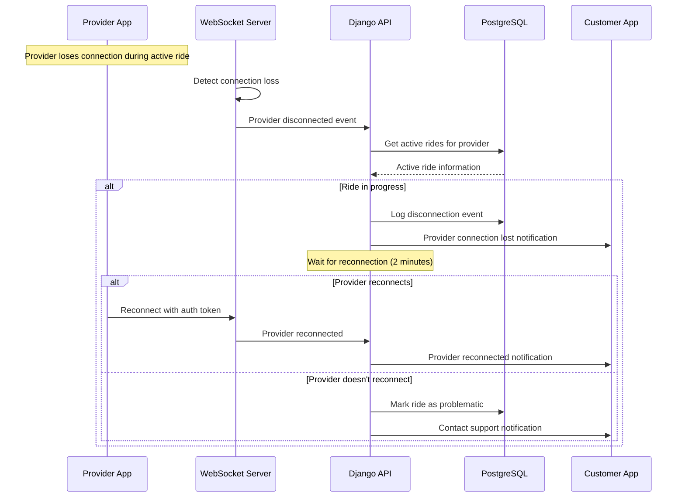

# Ride Booking Sequence Diagrams

## Complete Customer Ride Booking Flow

## Provider Ride Acceptance Flow

## Price Calculation Sequence

## Error Handling Sequences

### Ride Request Timeout

### Provider Disconnection Handling

## Key Features Demonstrated

1. **Atomic Operations**: Database locks prevent race conditions
2. **Real-time Communication**: WebSocket for instant updates
3. **Fault Tolerance**: Timeout handling and reconnection logic
4. **Scalability**: Async processing and caching
5. **User Experience**: Immediate feedback and status updates
6. **Business Logic**: Complex pricing calculations and zone detection