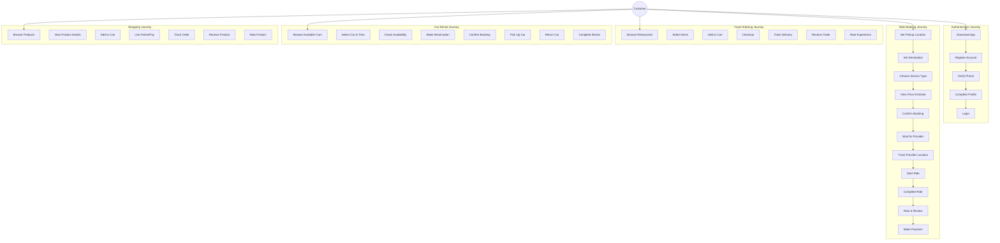
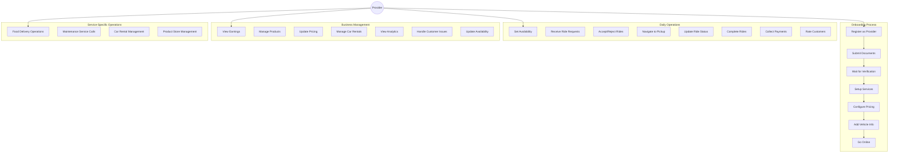

# System Use Case Diagrams

## Complete System Overview

```mermaid
graph TB
    %% Actors
    Customer((Customer))
    Provider((Provider/Driver))
    Admin((Admin))
    System((System))
    
    %% Customer Use Cases
    subgraph "Customer Use Cases"
        UC1[Register Account]
        UC2[Verify Phone Number]
        UC3[Login/Logout]
        UC4[Update Profile]
        UC5[Book Ride]
        UC6[Track Ride]
        UC7[Cancel Ride]
        UC8[Rate Driver]
        UC9[View Ride History]
        UC10[Order Food]
        UC11[Rent Car]
        UC12[Browse Products]
        UC13[Make Purchase]
        UC14[Manage Points]
        UC15[Receive Notifications]
        UC16[Save Favorite Places]
    end
    
    %% Provider Use Cases
    subgraph "Provider Use Cases"
        UC17[Register as Provider]
        UC18[Setup Driver Profile]
        UC19[Add Vehicle Info]
        UC20[Accept Ride Requests]
        UC21[Update Ride Status]
        UC22[Update Location]
        UC23[Rate Customer]
        UC24[Manage Services]
        UC25[Set Pricing]
        UC26[Manage Products]
        UC27[Manage Car Rentals]
        UC28[View Earnings]
        UC29[Manage Availability]
    end
    
    %% Admin Use Cases
    subgraph "Admin Use Cases"
        UC30[Manage Users]
        UC31[Verify Providers]
        UC32[Manage Services]
        UC33[Configure Pricing Zones]
        UC34[Monitor System]
        UC35[Generate Reports]
        UC36[Manage Notifications]
        UC37[System Configuration]
        UC38[Handle Disputes]
    end
    
    %% System Use Cases
    subgraph "System Use Cases"
        UC39[Send Notifications]
        UC40[Process Payments]
        UC41[Calculate Pricing]
        UC42[Match Providers]
        UC43[Track Locations]
        UC44[Generate Analytics]
        UC45[Backup Data]
        UC46[Monitor Performance]
    end
    
    %% Customer Connections
    Customer --> UC1
    Customer --> UC2
    Customer --> UC3
    Customer --> UC4
    Customer --> UC5
    Customer --> UC6
    Customer --> UC7
    Customer --> UC8
    Customer --> UC9
    Customer --> UC10
    Customer --> UC11
    Customer --> UC12
    Customer --> UC13
    Customer --> UC14
    Customer --> UC15
    Customer --> UC16
    
    %% Provider Connections
    Provider --> UC17
    Provider --> UC18
    Provider --> UC19
    Provider --> UC20
    Provider --> UC21
    Provider --> UC22
    Provider --> UC23
    Provider --> UC24
    Provider --> UC25
    Provider --> UC26
    Provider --> UC27
    Provider --> UC28
    Provider --> UC29
    
    %% Admin Connections
    Admin --> UC30
    Admin --> UC31
    Admin --> UC32
    Admin --> UC33
    Admin --> UC34
    Admin --> UC35
    Admin --> UC36
    Admin --> UC37
    Admin --> UC38
    
    %% System Connections
    System --> UC39
    System --> UC40
    System --> UC41
    System --> UC42
    System --> UC43
    System --> UC44
    System --> UC45
    System --> UC46
    
    %% Include Relationships
    UC5 -.->|includes| UC41
    UC5 -.->|includes| UC42
    UC20 -.->|includes| UC22
    UC21 -.->|includes| UC39
    UC13 -.->|includes| UC40
    UC27 -.->|includes| UC29
```

## Customer Journey Use Cases

## Provider Business Use Cases

## Admin Management Use Cases

```mermaid
graph TB
    Admin((Admin))
    
    subgraph "User Management"
        UM1[View All Users]
        UM2[Verify Providers]
        UM3[Suspend/Activate Users]
        UM4[Handle User Disputes]
        UM5[Manage User Roles]
    end
    
    subgraph "System Configuration"
        SC1[Manage Services]
        SC2[Configure Pricing Zones]
        SC3[Set System Parameters]
        SC4[Manage Notifications]
        SC5[Configure Integrations]
        SC6[Update App Settings]
    end
    
    subgraph "Business Operations"
        BO1[Monitor Ride Activities]
        BO2[Track Revenue]
        BO3[Analyze Performance]
        BO4[Generate Reports]
        BO5[Manage Promotions]
        BO6[Handle Complaints]
    end
    
    subgraph "Technical Management"
        TM1[Monitor System Health]
        TM2[Manage Database]
        TM3[Configure Servers]
        TM4[Backup Management]
        TM5[Security Monitoring]
        TM6[Performance Optimization]
    end
    
    Admin --> UM1
    Admin --> UM2
    Admin --> UM3
    Admin --> UM4
    Admin --> UM5
    
    Admin --> SC1
    Admin --> SC2
    Admin --> SC3
    Admin --> SC4
    Admin --> SC5
    Admin --> SC6
    
    Admin --> BO1
    Admin --> BO2
    Admin --> BO3
    Admin --> BO4
    Admin --> BO5
    Admin --> BO6
    
    Admin --> TM1
    Admin --> TM2
    Admin --> TM3
    Admin --> TM4
    Admin --> TM5
    Admin --> TM6
```

## Use Case Relationships

### Include Relationships
- **Book Ride** includes **Calculate Price**
- **Accept Ride** includes **Update Location**
- **Complete Purchase** includes **Process Payment**
- **Manage Car Rental** includes **Check Availability**

### Extend Relationships
- **Book Ride** extends **Apply Discount Code**
- **Rate Driver** extends **Add Tip**
- **Register Provider** extends **Upload Documents**
- **View Earnings** extends **Export Report**

### Generalization Relationships
- **Ride Services** generalizes **Food Delivery**, **Transportation**, **Maintenance**
- **User Management** generalizes **Customer Management**, **Provider Management**
- **Payment Processing** generalizes **Card Payment**, **Points Payment**, **Cash Payment**

## Business Rules Captured

1. **Authentication**: All users must verify phone numbers
2. **Provider Verification**: Providers must be verified before accepting rides
3. **Ride Matching**: System automatically matches customers with nearby providers
4. **Pricing**: Dynamic pricing based on zones, time, and demand
5. **Rating**: Bidirectional rating system for quality assurance
6. **Availability**: Real-time availability tracking for all services
7. **Notifications**: Automated notifications for all status changes
8. **Points System**: Loyalty points for customer retention