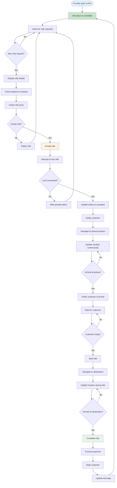
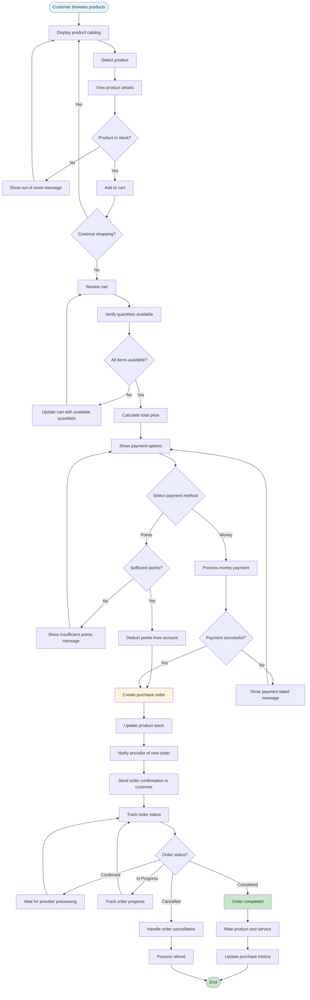
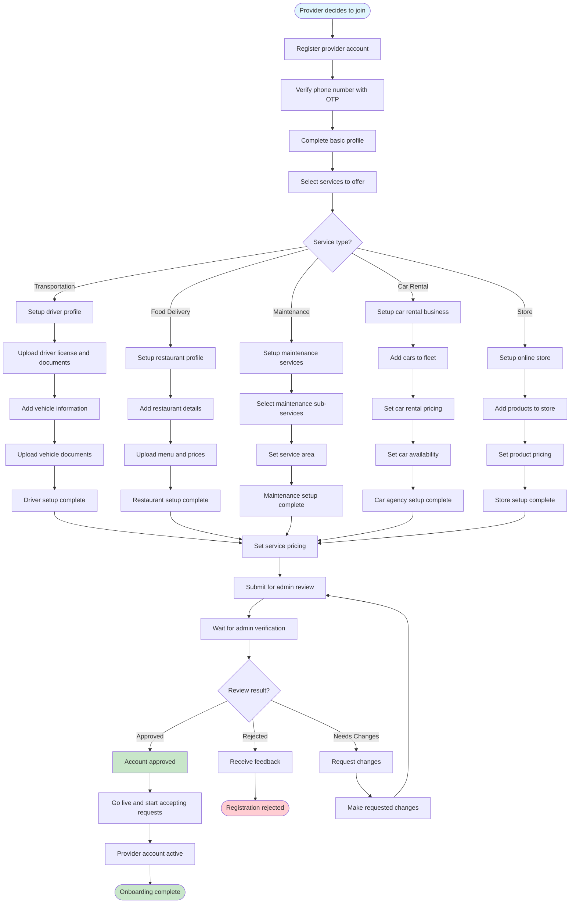

# Business Process Activity Diagrams

## Customer Ride Booking Process

```mermaid
flowchart TD
    Start([Customer opens app]) --> Auth{Authenticated?}
    Auth -->|No| Login[Login/Register Process]
    Login --> Auth
    Auth -->|Yes| Location[Get current location]
    
    Location --> SetPickup[Set pickup location]
    SetPickup --> SetDestination[Set destination]
    SetDestination --> SelectService[Choose service type]
    
    SelectService --> PriceCalc[Calculate price estimate]
    PriceCalc --> ShowPrice[Display price to customer]
    ShowPrice --> Confirm{Confirm booking?}
    
    Confirm -->|No| SelectService
    Confirm -->|Yes| CreateRequest[Create ride request]
    
    CreateRequest --> BroadcastRequest[Broadcast to nearby providers]
    BroadcastRequest --> WaitResponse[Wait for provider response]
    
    WaitResponse --> CheckTimeout{Timeout reached?}
    CheckTimeout -->|Yes| TimeoutAction[Handle timeout]
    TimeoutAction --> Retry{Retry booking?}
    Retry -->|Yes| BroadcastRequest
    Retry -->|No| CancelRequest[Cancel request]
    
    CheckTimeout -->|No| ProviderResponse{Provider responds?}
    ProviderResponse -->|Accept| RideAccepted[Ride accepted]
    ProviderResponse -->|Reject| WaitResponse
    
    RideAccepted --> TrackProvider[Track provider location]
    TrackProvider --> ProviderStatus{Provider status?}
    
    ProviderStatus -->|Starting| TrackProvider
    ProviderStatus -->|Arriving| WaitPickup[Wait at pickup location]
    ProviderStatus -->|Arrived| StartRide[Start ride]
    ProviderStatus -->|Cancelled| HandleCancel[Handle cancellation]
    
    StartRide --> InTransit[Ride in progress]
    InTransit --> TrackRide[Track ride progress]
    TrackRide --> RideComplete{Ride completed?}
    
    RideComplete -->|No| TrackRide
    RideComplete -->|Yes| ProcessPayment[Process payment]
    
    ProcessPayment --> PaymentSuccess{Payment successful?}
    PaymentSuccess -->|No| RetryPayment[Retry payment]
    RetryPayment --> PaymentSuccess
    PaymentSuccess -->|Yes| RateDriver[Rate driver]
    
    RateDriver --> UpdateHistory[Update ride history]
    UpdateHistory --> End([End])
    
    CancelRequest --> End
    HandleCancel --> End
    
    style Start fill:#e1f5fe
    style End fill:#c8e6c9
    style CreateRequest fill:#fff3e0
    style RideAccepted fill:#e8f5e8
    style ProcessPayment fill:#f3e5f5
```



## Provider Ride Acceptance Process



## Product Purchase Process



## Car Rental Booking Process

```mermaid
flowchart TD
    Start([Customer wants to rent car]) --> BrowseCars[Browse available cars]
    BrowseCars --> FilterCars[Apply filters (brand, price, location)]
    FilterCars --> SelectCar[Select car]
    
    SelectCar --> ViewCarDetails[View car details and images]
    ViewCarDetails --> SelectDateTime[Select rental date and time]
    
    SelectDateTime --> CheckAvailability[Check car availability]
    CheckAvailability --> AvailabilityResult{Car available?}
    
    AvailabilityResult -->|No| ShowAlternatives[Show alternative times/cars]
    ShowAlternatives --> SelectDateTime
    
    AvailabilityResult -->|Yes| CalculatePrice[Calculate rental price]
    CalculatePrice --> ShowPricing[Show pricing breakdown]
    
    ShowPricing --> ConfirmBooking{Confirm booking?}
    ConfirmBooking -->|No| SelectDateTime
    
    ConfirmBooking -->|Yes| ValidateBooking[Validate booking details]
    ValidateBooking --> CheckOverlap[Check for time overlaps]
    
    CheckOverlap --> OverlapFound{Overlap detected?}
    OverlapFound -->|Yes| BookingConflict[Show booking conflict]
    BookingConflict --> SelectDateTime
    
    OverlapFound -->|No| CreateRental[Create rental booking]
    CreateRental --> ProcessPayment[Process payment]
    
    ProcessPayment --> PaymentResult{Payment successful?}
    PaymentResult -->|No| PaymentError[Handle payment error]
    PaymentError --> ProcessPayment
    
    PaymentResult -->|Yes| ConfirmRental[Confirm rental booking]
    ConfirmRental --> UpdateAvailability[Update car availability]
    UpdateAvailability --> NotifyProvider[Notify car provider]
    
    NotifyProvider --> SendConfirmation[Send booking confirmation]
    SendConfirmation --> RentalActive[Rental booking active]
    
    RentalActive --> RentalTime{Rental time arrived?}
    RentalTime -->|No| WaitRentalTime[Wait for rental time]
    WaitRentalTime --> RentalTime
    
    RentalTime -->|Yes| StartRental[Start rental period]
    StartRental --> TrackRental[Track rental status]
    
    TrackRental --> RentalEnd{Rental period ended?}
    RentalEnd -->|No| TrackRental
    RentalEnd -->|Yes| CompleteRental[Complete rental]
    
    CompleteRental --> ProcessReturn[Process car return]
    ProcessReturn --> InspectCar[Inspect car condition]
    InspectCar --> CalculateFinalCost[Calculate final cost]
    
    CalculateFinalCost --> ProcessFinalPayment[Process any additional charges]
    ProcessFinalPayment --> RateExperience[Rate rental experience]
    RateExperience --> UpdateHistory[Update rental history]
    UpdateHistory --> End([End])
    
    style Start fill:#e1f5fe
    style CreateRental fill:#fff3e0
    style CompleteRental fill:#e8f5e8
    style End fill:#c8e6c9
```

## Provider Onboarding Process



## Key Process Features

### Parallel Processing
- Location updates happen concurrently with ride progress
- Multiple providers can receive requests simultaneously
- Background tasks process payments and notifications

### Error Handling
- Timeout mechanisms for unresponsive providers
- Retry logic for failed payments
- Fallback options for unavailable services

### Business Rules Enforcement
- Stock validation before purchase completion
- Availability checks before booking confirmation
- Verification requirements for provider onboarding

### User Experience Optimization
- Real-time status updates
- Immediate feedback on user actions
- Clear error messages and recovery options

### Scalability Considerations
- Asynchronous processing for heavy operations
- Caching for frequently accessed data
- Load balancing for high-traffic scenarios