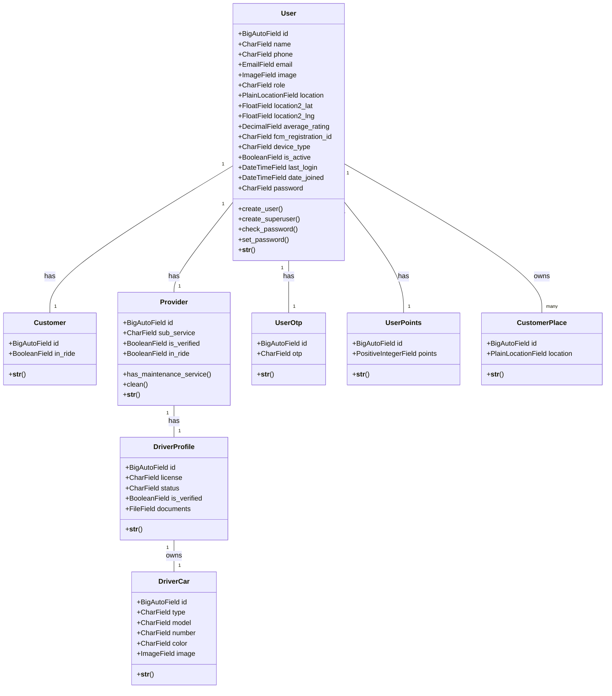

# Core Models Class Diagram

## User Management Models

This diagram shows the core user management structure of the ride-sharing platform.

## Key Relationships

1. **User → Customer/Provider**: One-to-one relationship based on user role
2. **Provider → DriverProfile**: Optional one-to-one for providers who are drivers
3. **DriverProfile → DriverCar**: One-to-one relationship for vehicle information
4. **User → UserOtp**: One-to-one for OTP verification
5. **User → UserPoints**: One-to-one for loyalty points system
6. **User → CustomerPlace**: One-to-many for saved locations

## Business Rules

- Users can only have one role (Customer, Provider, or Admin)
- Only verified providers can accept rides
- Driver profiles are only for providers with transportation services
- Sub-services are only applicable for maintenance service providers
- OTP is required for account activation
