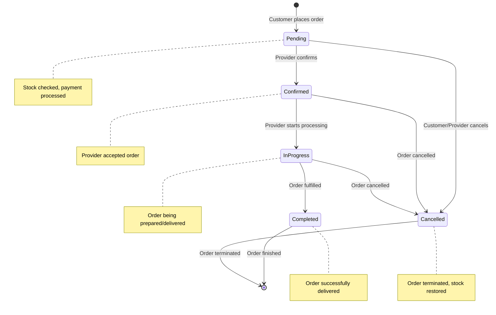
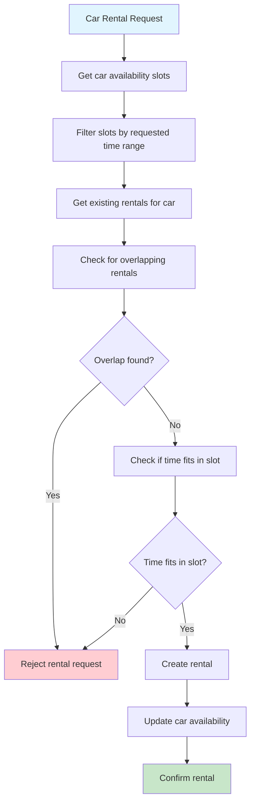

# E-commerce Models Class Diagram

## Product and Purchase Management

This diagram shows the e-commerce functionality of the platform.

```mermaid
classDiagram
    class Product {
        +id: BigAutoField
        +provider: ForeignKey→Provider
        +name: CharField[100]
        +description: TextField
        +display_price: PositiveIntegerField
        +stock: PositiveIntegerField
        +is_active: BooleanField
        +created_at: DateTimeField
        +updated_at: DateTimeField
        --
        +save(): void
        +__str__(): str
    }

    class ProductImage {
        +id: BigAutoField
        +product: ForeignKey→Product
        +image: ImageField
        --
        +__str__(): str
    }

    class Purchase {
        +id: BigAutoField
        +customer: ForeignKey→Customer
        +product: ForeignKey→Product
        +money_spent: PositiveIntegerField
        +quantity: PositiveIntegerField
        +status: CharField[20] {pending|confirmed|in_progress|completed|cancelled}
        +created_at: DateTimeField
        --
        +__str__(): str
    }

    class UserPoints {
        +id: BigAutoField
        +user: OneToOneField→User
        +points: PositiveIntegerField
        --
        +add_points(amount: int): void
        +deduct_points(amount: int): bool
        +__str__(): str
    }

    class CarAgency {
        +id: BigAutoField
        +provider: ForeignKey→Provider
        +model: CharField[50]
        +brand: CharField[50]
        +color: CharField[20]
        +price_per_hour: DecimalField[10,2]
        +available: BooleanField
        +image: ImageField
        +created_at: DateTimeField
        --
        +update_availability(): void
        +__str__(): str
    }

    class CarAvailability {
        +id: BigAutoField
        +car: ForeignKey→CarAgency
        +start_time: DateTimeField
        +end_time: DateTimeField
        --
        +is_available(): bool
        +__str__(): str
    }

    class CarRental {
        +id: BigAutoField
        +customer: ForeignKey→Customer
        +car: ForeignKey→CarAgency
        +start_datetime: DateTimeField
        +end_datetime: DateTimeField
        +total_price: DecimalField[10,2]
        +status: CharField[20] {pending|confirmed|in_progress|completed|cancelled}
        +created_at: DateTimeField
        --
        +calculate_total_price(): void
        +save(): void
        +__str__(): str
    }

    %% Relationships
    Provider ||--o{ Product : "1:*"
    Product ||--o{ ProductImage : "1:*"
    Product ||--o{ Purchase : "1:*"
    Customer ||--o{ Purchase : "1:*"
    User ||--|| UserPoints : "1:1"
    Provider ||--o{ CarAgency : "1:*"
    CarAgency ||--o{ CarAvailability : "1:*"
    CarAgency ||--o{ CarRental : "1:*"
    Customer ||--o{ CarRental : "1:*"

    %% Styling
    classDef productClass fill:#fff8e1
    classDef purchaseClass fill:#e8f5e8
    classDef pointsClass fill:#f3e5f5
    classDef carClass fill:#e1f5fe

    class Product productClass
    class ProductImage productClass
    class Purchase purchaseClass
    class UserPoints pointsClass
    class CarAgency carClass
    class CarAvailability carClass
    class CarRental carClass
```

## Purchase Flow State Machine



## Car Rental Availability Algorithm



## Business Rules

### Product Management
- Only store providers can create products
- Stock automatically updates on purchase
- Products become inactive when stock reaches zero
- Multiple images per product supported

### Purchase Process
- Stock validation before purchase creation
- Automatic stock deduction on successful purchase
- Status tracking throughout fulfillment process
- Points system integration for loyalty rewards

### Car Rental System
- Availability slots define when cars can be rented
- Overlap detection prevents double booking
- Automatic availability calculation
- Hourly pricing with total cost calculation
- Status tracking for rental lifecycle

### Points System
- Users earn points through various activities
- Points can be used for discounts or purchases
- Automatic point calculation and management
- Transaction history for point usage