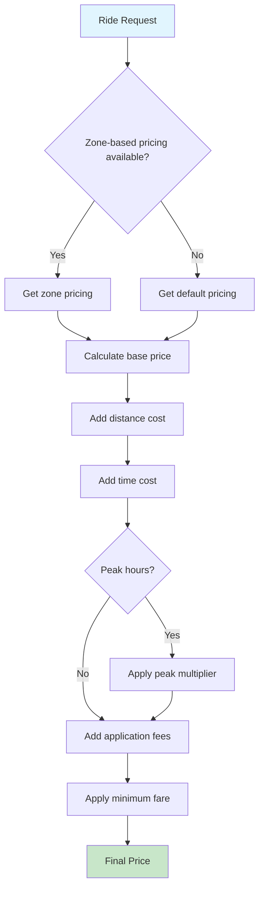

# Service Management Class Diagram

## Service and Pricing Models

This diagram shows the service management and pricing structure of the platform.

```mermaid
classDiagram
    class Service {
        +id: BigAutoField
        +name: CharField[20] {unique}
        +created_at: DateTimeField
        --
        +__str__(): str
    }

    class ServiceImage {
        +id: BigAutoField
        +service: ForeignKey→Service
        +image: ImageField
        --
        +__str__(): str
    }

    class PricingZone {
        +id: BigAutoField
        +name: CharField[100]
        +description: TextField
        +boundaries: JSONField
        +is_active: BooleanField
        +created_at: DateTimeField
        --
        +contains_point(lat: float, lng: float): bool
        +__str__(): str
    }

    class ProviderServicePricing {
        +id: BigAutoField
        +service: ForeignKey→Service
        +sub_service: CharField[50]
        +zone: ForeignKey→PricingZone
        +platform_fee: DecimalField[10,2]
        +service_fee: DecimalField[10,2]
        +booking_fee: DecimalField[10,2]
        +base_fare: DecimalField[10,2]
        +price_per_km: DecimalField[10,2]
        +price_per_minute: DecimalField[10,2]
        +minimum_fare: DecimalField[10,2]
        +peak_hour_multiplier: DecimalField[4,2]
        +peak_hours_start: TimeField
        +peak_hours_end: TimeField
        +is_active: BooleanField
        +created_at: DateTimeField
        +updated_at: DateTimeField
        --
        +calculate_price(distance_km, duration_minutes, pickup_time): float
        +get_pricing_for_location(service, sub_service, lat, lng): ProviderServicePricing
        +clean(): void
        +save(): void
        +__str__(): str
    }

    class RideStatus {
        +id: BigAutoField
        +client: ForeignKey→User
        +provider: ForeignKey→User
        +service: ForeignKey→Service
        +status: CharField[20] {pending|accepted|starting|arriving|finished|cancelled}
        +pickup_lat: FloatField
        +pickup_lng: FloatField
        +drop_lat: FloatField
        +drop_lng: FloatField
        +created_at: DateTimeField
        --
        +can_be_rated_by(user: User): bool
        +__str__(): str
    }

    class Rating {
        +id: BigAutoField
        +ride: OneToOneField→RideStatus
        +driver_rating: PositiveSmallIntegerField[1-5]
        +customer_rating: PositiveSmallIntegerField[1-5]
        +driver_comment: TextField
        +customer_comment: TextField
        +created_at: DateTimeField
        +updated_at: DateTimeField
        --
        +__str__(): str
    }

    class Notification {
        +id: BigAutoField
        +user: ForeignKey→User
        +title: CharField[255]
        +message: TextField
        +notification_type: CharField[20]
        +data: JSONField
        +is_read: BooleanField
        +created_at: DateTimeField
        --
        +mark_as_read(): void
        +__str__(): str
    }

    %% Relationships
    Service ||--o{ ServiceImage : "1:*"
    Service ||--o{ ProviderServicePricing : "1:*"
    Service ||--o{ RideStatus : "1:*"
    PricingZone ||--o{ ProviderServicePricing : "1:*"
    RideStatus ||--|| Rating : "1:1"
    Provider }o--o{ Service : "*:*"

    %% Styling
    classDef serviceClass fill:#fff3e0
    classDef pricingClass fill:#e8eaf6
    classDef rideClass fill:#e0f2f1
    classDef notificationClass fill:#fce4ec

    class Service serviceClass
    class ServiceImage serviceClass
    class PricingZone pricingClass
    class ProviderServicePricing pricingClass
    class RideStatus rideClass
    class Rating rideClass
    class Notification notificationClass
```

## Pricing Calculation Flow



## Key Features

### Zone-Based Pricing
- Geographic zones with polygon boundaries
- Different pricing for different areas
- Point-in-polygon algorithm for zone detection

### Dynamic Pricing
- Peak hour multipliers
- Time and distance-based calculation
- Minimum fare guarantees
- Application fees (platform, service, booking)

### Service Management
- Multiple services per provider
- Sub-services for specialized offerings
- Service-specific pricing rules

### Rating System
- Bidirectional rating (driver ↔ customer)
- Comments and numerical ratings
- Average rating calculation