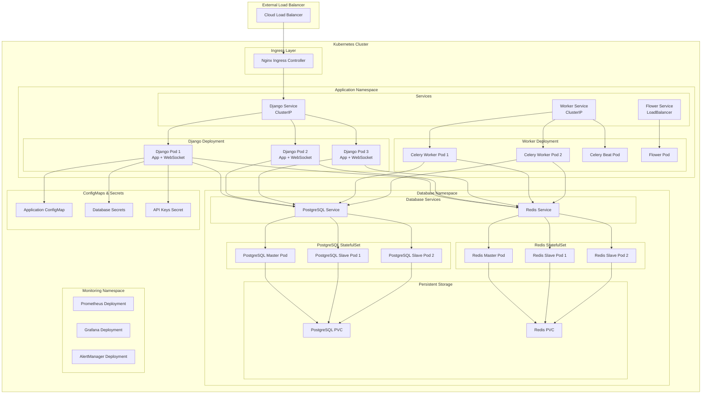
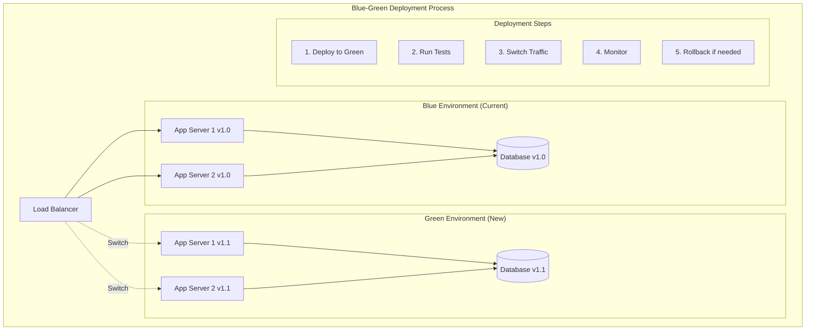
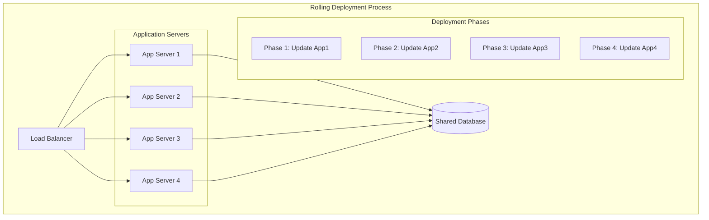
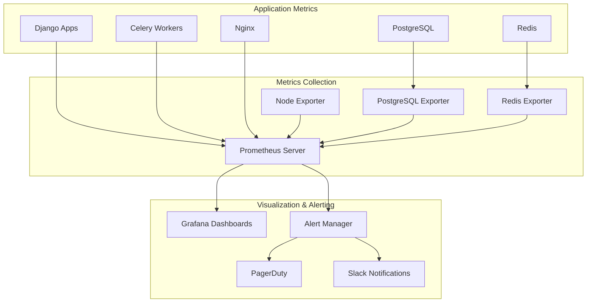
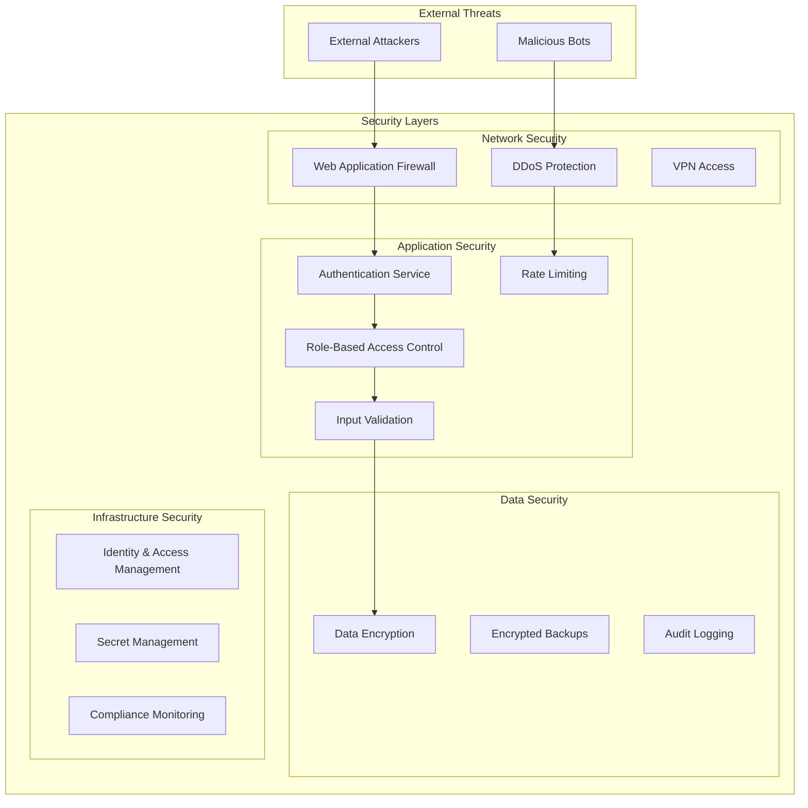

# Production Deployment Architecture

## High-Level Production Architecture

```mermaid
graph TB
    subgraph "External Users"
        MobileUsers[Mobile App Users]
        WebUsers[Web App Users]
        AdminUsers[Admin Users]
    end
    
    subgraph "CDN & Load Balancing"
        CDN[Content Delivery Network]
        LB[Load Balancer / Nginx]
    end
    
    subgraph "Application Tier - Auto Scaling Group"
        App1[Django App Server 1<br/>Daphne ASGI]
        App2[Django App Server 2<br/>Daphne ASGI]
        App3[Django App Server 3<br/>Daphne ASGI]
        WS1[WebSocket Server 1<br/>Channels]
        WS2[WebSocket Server 2<br/>Channels]
    end
    
    subgraph "Background Processing"
        CeleryWorker1[Celery Worker 1<br/>Task Processing]
        CeleryWorker2[Celery Worker 2<br/>Task Processing]
        CeleryBeat[Celery Beat<br/>Scheduler]
        Flower[Flower<br/>Monitoring]
    end
    
    subgraph "Database Cluster"
        PGMaster[(PostgreSQL Master<br/>Read/Write)]
        PGSlave1[(PostgreSQL Slave 1<br/>Read Only)]
        PGSlave2[(PostgreSQL Slave 2<br/>Read Only)]
    end
    
    subgraph "Cache & Message Broker"
        RedisCluster[Redis Cluster<br/>Cache & Sessions]
        RedisBroker[Redis Broker<br/>Celery Tasks]
    end
    
    subgraph "File Storage"
        S3[AWS S3<br/>Media Files]
        LocalStorage[Local Storage<br/>Static Files]
    end
    
    subgraph "External Services"
        FCM[Firebase FCM<br/>Push Notifications]
        SMS[SMS Gateway<br/>OTP Service]
        WhatsApp[WhatsApp API<br/>Messaging]
        Maps[Maps API<br/>Geocoding]
    end
    
    subgraph "Monitoring & Logging"
        Prometheus[Prometheus<br/>Metrics]
        Grafana[Grafana<br/>Dashboards]
        ELK[ELK Stack<br/>Logging]
        Sentry[Sentry<br/>Error Tracking]
    end
    
    subgraph "Backup & Recovery"
        BackupS3[AWS S3<br/>Database Backups]
        BackupLocal[Local Backup<br/>Critical Data]
    end
    
    %% User Connections
    MobileUsers --> CDN
    WebUsers --> CDN
    AdminUsers --> CDN
    
    %% CDN and Load Balancer
    CDN --> LB
    LB --> App1
    LB --> App2
    LB --> App3
    LB --> WS1
    LB --> WS2
    
    %% Application to Database
    App1 --> PGMaster
    App2 --> PGMaster
    App3 --> PGMaster
    App1 --> PGSlave1
    App2 --> PGSlave1
    App3 --> PGSlave2
    
    %% Database Replication
    PGMaster --> PGSlave1
    PGMaster --> PGSlave2
    
    %% Application to Cache
    App1 --> RedisCluster
    App2 --> RedisCluster
    App3 --> RedisCluster
    WS1 --> RedisCluster
    WS2 --> RedisCluster
    
    %% Background Processing
    CeleryWorker1 --> RedisBroker
    CeleryWorker2 --> RedisBroker
    CeleryBeat --> RedisBroker
    CeleryWorker1 --> PGMaster
    CeleryWorker2 --> PGMaster
    
    %% File Storage
    App1 --> S3
    App2 --> S3
    App3 --> S3
    CDN --> LocalStorage
    
    %% External Services
    App1 --> FCM
    App2 --> SMS
    App3 --> WhatsApp
    CeleryWorker1 --> Maps
    
    %% Monitoring
    App1 --> Prometheus
    App2 --> Prometheus
    App3 --> Prometheus
    Prometheus --> Grafana
    App1 --> ELK
    App2 --> ELK
    App3 --> ELK
    App1 --> Sentry
    
    %% Backup
    PGMaster --> BackupS3
    S3 --> BackupS3
    LocalStorage --> BackupLocal
    
    %% Monitoring Connections
    Flower --> CeleryWorker1
    Flower --> CeleryWorker2
    Flower --> CeleryBeat
```



## Container Orchestration with Kubernetes



## Docker Compose Development Environment

```mermaid
graph TB
    subgraph "Development Environment"
        subgraph "Application Services"
            Django[ride_server<br/>Django + Daphne<br/>Port: 8000]
            CeleryWorker[celery_worker<br/>Background Tasks]
            CeleryBeat[celery_beat<br/>Task Scheduler]
            Flower[celery_flower<br/>Task Monitor<br/>Port: 5555]
        end
        
        subgraph "Database Services"
            PostgreSQL[postgres<br/>PostgreSQL 15<br/>Port: 5432]
            Redis[redis<br/>Redis 7<br/>Port: 6379]
            PGAdmin[pgadmin<br/>DB Admin<br/>Port: 5050]
            RedisCommander[redis_commander<br/>Redis Admin<br/>Port: 8081]
        end
        
        subgraph "Volumes"
            PostgresData[postgres_data]
            RedisData[redis_data]
            PGAdminData[pgadmin_data]
            MediaFiles[./media]
            StaticFiles[./static]
            Logs[./logs]
        end
        
        subgraph "Networks"
            DefaultNetwork[default network<br/>bridge]
        end
    end
    
    subgraph "External Services"
        FCMService[Firebase FCM]
        SMSService[SMS Gateway]
        WhatsAppService[WhatsApp API]
    end
    
    %% Service Dependencies
    Django --> PostgreSQL
    Django --> Redis
    CeleryWorker --> Redis
    CeleryWorker --> PostgreSQL
    CeleryBeat --> Redis
    Flower --> Redis
    PGAdmin --> PostgreSQL
    RedisCommander --> Redis
    
    %% Volume Mounts
    PostgreSQL --> PostgresData
    Redis --> RedisData
    PGAdmin --> PGAdminData
    Django --> MediaFiles
    Django --> StaticFiles
    Django --> Logs
    CeleryWorker --> Logs
    CeleryBeat --> Logs
    Flower --> Logs
    
    %% External Connections
    Django --> FCMService
    Django --> SMSService
    Django --> WhatsAppService
    CeleryWorker --> FCMService
    CeleryWorker --> SMSService
    
    %% Network
    Django -.-> DefaultNetwork
    PostgreSQL -.-> DefaultNetwork
    Redis -.-> DefaultNetwork
    CeleryWorker -.-> DefaultNetwork
    CeleryBeat -.-> DefaultNetwork
    Flower -.-> DefaultNetwork
```



## Infrastructure as Code (Terraform)

```hcl
# Example Terraform configuration for AWS deployment

# VPC and Networking
resource "aws_vpc" "ride_sharing_vpc" {
  cidr_block           = "10.0.0.0/16"
  enable_dns_hostnames = true
  enable_dns_support   = true
  
  tags = {
    Name = "ride-sharing-vpc"
  }
}

# Public Subnets for Load Balancer
resource "aws_subnet" "public_subnet" {
  count             = 2
  vpc_id            = aws_vpc.ride_sharing_vpc.id
  cidr_block        = "10.0.${count.index + 1}.0/24"
  availability_zone = data.aws_availability_zones.available.names[count.index]
  
  map_public_ip_on_launch = true
  
  tags = {
    Name = "public-subnet-${count.index + 1}"
  }
}

# Private Subnets for Application
resource "aws_subnet" "private_subnet" {
  count             = 2
  vpc_id            = aws_vpc.ride_sharing_vpc.id
  cidr_block        = "10.0.${count.index + 10}.0/24"
  availability_zone = data.aws_availability_zones.available.names[count.index]
  
  tags = {
    Name = "private-subnet-${count.index + 1}"
  }
}

# ECS Cluster
resource "aws_ecs_cluster" "ride_sharing_cluster" {
  name = "ride-sharing-cluster"
  
  setting {
    name  = "containerInsights"
    value = "enabled"
  }
}

# Application Load Balancer
resource "aws_lb" "ride_sharing_alb" {
  name               = "ride-sharing-alb"
  internal           = false
  load_balancer_type = "application"
  security_groups    = [aws_security_group.alb_sg.id]
  subnets            = aws_subnet.public_subnet[*].id
  
  enable_deletion_protection = false
}

# RDS PostgreSQL
resource "aws_db_instance" "ride_sharing_db" {
  identifier     = "ride-sharing-db"
  engine         = "postgres"
  engine_version = "15.4"
  instance_class = "db.t3.medium"
  
  allocated_storage     = 100
  max_allocated_storage = 1000
  storage_type          = "gp2"
  storage_encrypted     = true
  
  db_name  = "ride_sharing"
  username = "postgres"
  password = var.db_password
  
  vpc_security_group_ids = [aws_security_group.rds_sg.id]
  db_subnet_group_name   = aws_db_subnet_group.ride_sharing_db_subnet_group.name
  
  backup_retention_period = 7
  backup_window          = "03:00-04:00"
  maintenance_window     = "sun:04:00-sun:05:00"
  
  skip_final_snapshot = true
  
  tags = {
    Name = "ride-sharing-database"
  }
}

# ElastiCache Redis
resource "aws_elasticache_subnet_group" "ride_sharing_cache_subnet" {
  name       = "ride-sharing-cache-subnet"
  subnet_ids = aws_subnet.private_subnet[*].id
}

resource "aws_elasticache_replication_group" "ride_sharing_redis" {
  replication_group_id       = "ride-sharing-redis"
  description                = "Redis cluster for ride sharing app"
  
  node_type                  = "cache.t3.micro"
  port                       = 6379
  parameter_group_name       = "default.redis7"
  
  num_cache_clusters         = 2
  automatic_failover_enabled = true
  multi_az_enabled          = true
  
  subnet_group_name = aws_elasticache_subnet_group.ride_sharing_cache_subnet.name
  security_group_ids = [aws_security_group.redis_sg.id]
  
  at_rest_encryption_enabled = true
  transit_encryption_enabled = true
  
  tags = {
    Name = "ride-sharing-redis"
  }
}
```

## Deployment Strategies

### Blue-Green Deployment



### Rolling Deployment



## Monitoring and Observability

### Metrics Collection



## Security Architecture



This comprehensive deployment documentation provides multiple deployment strategies suitable for different environments and scales, from development to enterprise production deployments.
